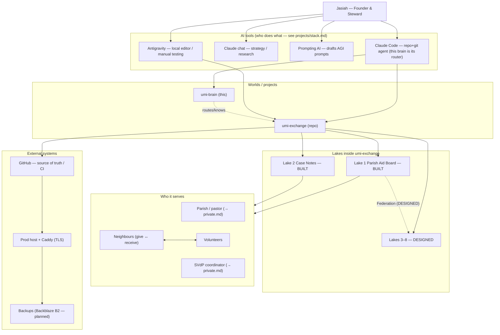

# Connections — the map (C2)

> STATUS: **DRAFT** by Claude Code, 2026-06-17, assembled from the repos + our conversation.
> Jasiah to verify/correct. Real names of people & parishes live in `inbox/private.md`
> (keyring rule — sensitive personal data stays out of git); this node uses **roles**.

## Does it change? — static vs live
The blueprint's C2 question. Decide per source:
- **Static → ingest** (plain markdown, right here): who's who, tool roles, the 8 lakes, project structure, the keyring.
- **Live → pull fresh every time, never cache**: repo/git state (`umi-exchange/STATE.md`), CI status, prod census output (`*_envelope_status`), deploy/cert health.
> "Markdown + an index takes you surprisingly far. No database needed at the start."

## The graph

## People & roles  (specifics → `inbox/private.md`)
- **Founder / Steward** — Jasiah (decides what the tools *can* do).
- **Parish pastor** and **SVdP coordinator** — the St. Patrick pilot stakeholders (names in private.md).
- **Volunteers / neighbours** — the give↔receive participants Lake 1 serves.

## Tooling links
- Tool roles & the prompting workflow → `projects/stack.md`.
- The lakes & conformance ladder → `vision/what-is-umi.md`.
- What an agent may do with any connection → `trust/keyring.md`.

## Open (Jasiah to fill)
- Other real people in the network (advisors, collaborators, diocese contacts)?
- Which external services are live vs planned (B2? domain/DNS? monitoring)?
