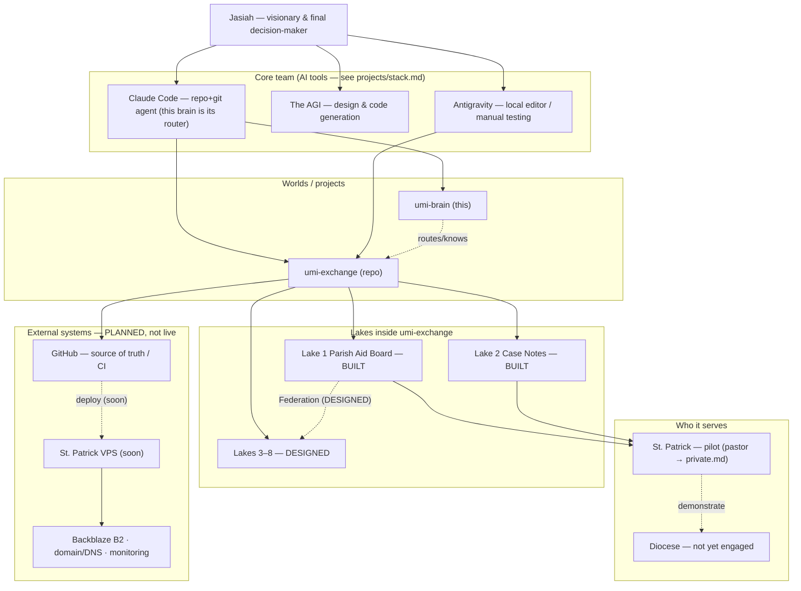

# Connections — the map (C2)

> STATUS: **CONFIRMED by Jasiah, 2026-06-17 (interview round 2).** Update when real partners join.
> Real names of people & parishes live in `inbox/private.md` (keyring rule); this node uses roles.

## Does it change? — static vs live
- **Static → ingest** (markdown here): who's who, tool roles, the 8 lakes, project structure, the keyring.
- **Live → pull fresh, never cache**: repo/git state (`umi-exchange/STATE.md`), CI status, prod census output (`*_envelope_status`), deploy/cert health.

## Status (confirmed)
| Connection | Status | Notes |
|---|---|---|
| **Me — Jasiah** | The visionary & final decision-maker | the anchor of the network |
| **Advisors** | None formal yet | the pastor at St. Patrick is the first real pilot partner |
| **Diocese** | Not yet engaged | St. Patrick is the beachhead → demonstrate to the diocese from there |
| **Collaborators (core team)** | me · Claude Code · the AGI · Antigravity (local) | the working team today |
| **Community** | **St. Patrick (pilot)** | first real community |
| **External services** | **Planned, not live** | Backblaze, domain/DNS, monitoring — in the runbook, not yet deployed |

**Live today:** `umi-exchange` on Jasiah's local machine (soon St. Patrick's VPS). Everything else is planned.

## The graph

## Links
- Tool roles & prompting workflow → `projects/stack.md` · Lakes → `vision/what-is-umi.md` · Permissions → `trust/keyring.md`.
