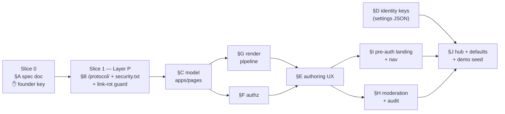

# Community identity pipeline

The staged plan for giving each community its own front door: a canonical UMI Protocol
document (Layer P, "the floor") and coordinator-authored community pages plus small
structured identity facts (Layer C). Each stage is keyed (✋) by the founder before the next
begins. This document is the committed record of those keys.

> Note: this document intentionally contains historical mentions of the unregistered domains
> `umi-protocol.org` and `umi-exchange.org` — it is the allowlisted exception in the
> link-rot guard (B5).

---

# ✋ STAGE 1 — KEYED (rulings)

Stage 1 established the step list and closed four rulings:

1. **Security contact** = the founder's monitored personal email until a real domain is
   registered and deployed (upgrade path to `security@<domain>` noted in the spec).
2. **Renderer** = `markdown` + `nh3`, exact `==` version pins with a why-comment and a
   threat-model note.
3. **Roles**: coordinators draft and edit; ONLY admins publish.
4. **Pages are flaggable** — one moderation model shared with needs/offers/members, not a
   parallel system.

---

# ✋ STAGE 2 — KEYED (the spec sheet)

This stage turns every Stage-1 step into spec sections: purpose, data, behavior, edge cases,
what-not-to-do. Nothing here is implementation — Stage 3 (the outline) follows.

**Answering the Stage-2 confirmation:** the ordering field survives as **`sort_order`** —
verified as the repo's established name (`Tag`, `Category`, `Resource` all use
`sort_order = models.IntegerField(default=0)`); same semantics as asked.

**New spec-level decisions surfaced for this key (not previously ruled):**

1. **Edits require draft state** — no editing published pages in place; live fix = admin
   unpublish → edit → admin publish. Otherwise "only admins publish" is vacuous.
2. **Slug freezes at first publish** (links are promises); archived pages release their slug;
   restore blocked if slug was retaken (message, no silent rename).
3. **New app `apps/pages`** (not inside the oversized communities app; avoids the
   `templates/pages/` marketing-dir clash — templates live in `templates/community_pages/`).
4. **Anonymous no-oracle rule:** every non-renderable pre-auth case returns the identical
   login redirect — private communities and nonexistent slugs indistinguishable to anon
   (already true today via `LoginRequiredMixin`; the new anon branch must not break it).
5. **Moderation hide = `moderation_hidden` bool** (Need/Offer precedent,
   `apps/needs/models.py`), never overloading `archived`.
6. **security.txt gets exactly one source of truth** — a Django view; the inline Caddy copy
   and the unserved static file are removed (see repo-verification notes below).

## Repo-verification notes (checked against the tree at key time)

- The 59 distinct §-refs (§0–§13, incl. cited-but-unbuilt §12.3) were counted exactly;
  word-form "Section N" refs exist (`apps/audit/models.py`, `apps/matches/models.py`) and
  need A1's normalization.
- `templates/pages/` is taken by the mission pages (about/beliefs/privacy/technology/why_umi)
  — `templates/community_pages/` stands.
- `Flag.target_type` is `max_length=12` ("page" fits); the one-open-flag-per-reporter partial
  unique constraint exists; `FlagResolveView`'s hide branch already flips
  `moderation_hidden` generically for non-member targets — its shape is untouched.
- `AuditLog.action` is `max_length=32` (`community.identity_set` = 22 chars fits).
- `CommunitySettingsView` soft-redirects non-coordinators (`messages.error` + redirect to
  feed) — the F-matrix "soft-redirect" precedent.
- **security.txt had TWO conflicting sources of truth, neither served by Django:**
  `static/well-known/security.txt` (unserved — WhiteNoise handles `/static/…` only) and an
  inline `respond` block in `docker/Caddyfile.prod` with different content. Ruling 6 above.
  The static file's Expires (2027-01-01) is already inside a year and would fail the +1y test.
- **`umi-protocol.org` is not the only dead domain:** `security@umi-exchange.org` (static
  security.txt + Caddyfile) and `staging.umi-exchange.org`
  (`config/settings/staging.py` ALLOWED_HOSTS default) are fabricated-domain references too —
  B5's denylist seeds both domains and its scan includes `config/` and `docker/`.
- Concrete mount points: pages URLs mount as
  `path("c/<slug:slug>/p/", include(("apps.pages.urls", "pages"), namespace="pages"))` in
  `config/urls.py` (casework/moderation/tags precedent); `/protocol/` joins
  `apps/communities/urls_mission.py` (login-exempt mission-page pattern, `TechnologyView`
  shape).
- Hub anchors: there is no "hub community card"; the real anchors are the greeting header and
  `umi-pill` quick-actions nav in `templates/hub/_hub_body.html`, and the footer in
  `templates/base.html` (the protocol line to repoint lives there).
- `scene_choices` validates against the 10 committed prints in `templates/illustrations/`
  (`_well`, `_board`, `_exchange`, `_hill`, `_lakes`, `_spring`, `_threshold`, `_carrying`,
  `_one_place`, `_priest`), keyed by template stem; unknown slug falls back silently
  (`resolve_theme` posture).
- Dependency pin precedent: `requirements.txt` is `>=`-style except
  `ruff==0.15.14  # pinned: …why…` — `markdown==X` / `nh3==X` follow that exact form.

## Shape of the build (slice dependency order)

§D is independent of §C–§I (pure `Community.settings` keys) and can land in parallel once
Slice 1 is through. Every slice ends with `/gate` (full suite, Postgres).

## SPEC SECTIONS (the sheet itself; each = purpose / data / behavior / edges / not-do)

### §A — Slice 0: the protocol document

- **A1 Citation inventory.** Purpose: fixed skeleton. Data: the 59 distinct §-refs (§0–§13;
  count verified against the tree) with their context lines →
  `docs/protocol/citation-inventory.md`. Behavior: script-extracted, committed. Edges:
  cited-but-unbuilt (§12.3) → reserved non-normative; word-form "Section N" refs (audit,
  matches docstrings) normalized into the inventory. Not-do: no invented sections, no
  renumbering.
- **A2 Spec document.** Purpose: canonical v0.1. Data: `docs/protocol/spec.md`, CC-BY-4.0
  header, steward line, conformance clause (Core/Casework/Federation → MUST-sections).
  Behavior: RFC-2119 text derived from implemented behavior only; traceability table
  (section → evidence file:line) as companion working doc. Edges: protocol-vs-implementation
  line written into §0 (wire behavior / data semantics / privacy invariants / state machines
  = protocol; Django/HTMX/libs = implementation notes). Not-do: nothing aspirational
  normative; no edits after the founder key except versioned change control. ✋ separate
  FOUNDER KEY on the draft itself.

### §B — Layer P: the floor (Slice 1, post-spec-key)

- **B1 /protocol/ page.** Purpose: footer line true offline. Data: build-time pre-rendered
  HTML fragment (committed) + generated anchored TOC; staleness test hashes `spec.md` vs
  fragment. Behavior: public view, no auth, mounted in `apps/communities/urls_mission.py`
  (login-exempt mission-page precedent; `TechnologyView` shape), default Commons chrome
  (community-unscoped — keyed refinement), voice.md intro block, CC-BY-4.0 notice visible.
  Edges: 390px TOC as top jump list; long-doc anchor offsets under sticky header; DEBUG-off +
  WhiteNoise (template render, not staticfile). Not-do: no runtime markdown dep for Layer P;
  no community data in context.
- **B2 /protocol/spec.md raw.** View streams the canonical file,
  `text/markdown; charset=utf-8`. Edge: file missing → 500 with the human template (never a
  traceback). Not-do: no static-pipeline dependence.
- **B3 Reference repoint.** All five live references (verified complete by grep):
  `templates/base.html` footer line + `templates/components/_protocol_badge.html` →
  ``; `templates/emails/notification.html` → SITE_URL-built absolute
  (adapter precedent `apps/notifications/adapter.py`); `README.md` (2 spots) → repo-relative
  `docs/protocol/spec.md`; dead domain fully removed (keyed). Edge: badge tooltip keeps
  conformance-level display. Not-do: no external domain anywhere until registered.
- **B4 security.txt — one source of truth.** Today two copies disagree and neither is
  Django-served: `static/well-known/security.txt` (unserved) and an inline `respond` in
  `docker/Caddyfile.prod`. Spec: a Django view at `/.well-known/security.txt` (root urls,
  next to the mission includes) is the ONLY copy; delete the static file; delete the Caddy
  `respond` block so the path proxies through. Content: Contact = founder's monitored
  personal email (keyed; spec notes upgrade path to `security@<domain>` at real-domain
  deploy — replaces the fabricated `security@umi-exchange.org`); Expires future-dated (+1y,
  test-enforced); Policy → `SECURITY.md` (created, plain-language, voice-checked) linked via
  repo URL + mirrored in the /protocol/ intro; Canonical self-reference. Test validates
  RFC 9116 basics against the live view. Not-do: no field that doesn't resolve; no second
  copy anywhere.
- **B5 Link-rot guard.** Test scanning `templates/`, `static/`, `docs/`, `README.md`,
  `apps/`, `config/`, `docker/` for a denylist seeded with `umi-protocol.org` AND
  `umi-exchange.org` (catches `security@…` and the `staging.…` ALLOWED_HOSTS default —
  `config/settings/staging.py` gets a placeholder/env-only default in the same slice). Fails
  suite on hit. Edge: explicit exception list allowlists the historical mentions inside
  `docs/community-identity-pipeline.md` itself.
- **B6 Leak test.** Logged-out `/protocol/` + `/protocol/spec.md` rendered against seeded DB
  contain no community names/member counts/join codes.

### §C — Layer C data model (`apps/pages.CommunityPage`)

Fields: id UUID pk · community FK (CASCADE, related_name="pages") · title Char(120) ·
slug Slug(80), UniqueConstraint(community, slug) conditional on `status != "archived"` ·
status Char(12) draft/published/archived via `StateMachineMixin` (`apps/common/state.py`;
draft→published/archived; published→draft/archived; archived→draft restore;
`TRANSITION_TIMESTAMPS` drives published_at/archived_at) · content_md Text (form cap 20k
chars) · content_html Text editable=False (nh3 is the ONLY writer) · show_on_landing Bool
default False · sort_order Int default 0 · moderation_hidden Bool default False ·
created_by PROTECT / updated_by SET_NULL / published_by SET_NULL (Member FKs) ·
published_at / first_published_at / archived_at · created_at/updated_at.
Index (community, status, show_on_landing).

Visibility predicate (one queryset helper): member-visible ⇔ published ∧ ¬hidden;
pre-auth-visible ⇔ member-visible ∧ show_on_landing ∧ community.visibility ≠ "private" ∧
community.is_active. (Community.visibility choices verified: public/private/unlisted.)

Edges: slug freeze at first publish (first_published_at set ⇒ slug immutable); archived
releases slug (the conditional constraint excludes archived rows); restore-with-retaken-slug
blocked inside the locked transition (pre-check under the row lock → warm message, no silent
rename, no IntegrityError 500); content race = last-write-wins audited (state races = 409 via
mixin); community deactivation 404s all surfaces. Not-do: no delete anywhere; no per-page
theming; no HTML storage.

### §D — Structured identity (Community.settings, additive keys)

`patron` (Char ≤80, e.g. "St. Patrick"), `welcome_line` (≤140), `signin_blurb` (≤300),
`scene_choices` (dict surface→scene-slug validated against the 10 committed prints in
`templates/illustrations/`; uploads keyed OUT). Purpose: the small facts; pages carry the
rest — the WordPress line. Behavior: edited in the settings surface; `set_theme` precedent
(`apps/communities/views.py` — validate, write `community.settings`, `emit`) for the action
shape; rendered with graceful absence (zero-customization = today's warm defaults, goal 11);
unknown scene slug falls back silently like `resolve_theme` does for unknown themes.
**The wall has no second door (Stage-3 keyed amendment):** identity facts render auto-escaped
in every template — never `|safe`, never concatenated into HTML; a `<script>` in `welcome_line`
displays as text. Edges: emoji/length, blank-clears-key, switcher swaps the whole bundle;
red-team row: script tag in `welcome_line` renders inert on hub, sign-in, and landing. Not-do:
no freeform HTML
keys; no per-key audit PII (log key names only: `community.identity_set` — 22 chars, fits
the 32-char audit action column).

### §E — Authoring UX (the "Your pages" manager)

Settings page (`templates/communities/settings.html`) gains a Pages section (after
Categories) → manage list at `/c/<slug>/p/manage/`: list (status chips, sort_order, landing
toggle), editor (title, slug-while-draft, markdown textarea + server-rendered preview
endpoint using the identical pipeline, show_on_landing, sort_order), actions
publish/unpublish/archive/restore as POST forms. Wizard untouched (keyed lean); pointer link
only. Empty state: "No pages yet. Your story is worth telling. Start with one."
Edges: preview of unsaved text (POST body render, never persisted); private-community note
on the landing toggle ("your community is private, so this stays members-only"); 30-page
list stays scannable (sort + status filter). Not-do: no WYSIWYG, no autosave v1.

### §F — Authz matrix (repo failure-mode precedents)

| action | anon | non-member | member | coordinator | admin |
|---|---|---|---|---|---|
| view published (member) | login-redir | 404 | ✓ | ✓ | ✓ |
| view pre-auth page | ✓ (eligible only) | ✓ | ✓ | ✓ | ✓ |
| view draft (canonical URL + banner) | login-redir | 404 | 404 | ✓ | ✓ |
| create/edit draft/manage | login-redir | 404 | soft-redirect | ✓ | ✓ |
| edit published in place | — | — | — | ✗ no such action | ✗ |
| publish / unpublish | login-redir | 404 | 403 | **403** | ✓ |
| archive published | login-redir | 404 | 403 | 403 | ✓ |
| archive draft / restore | login-redir | 404 | soft-redirect | ✓ | ✓ |
| flag published page | control absent | 404 | ✓ | ✓ | ✓ |

Per-view dispatch resolution (repo pattern, no middleware). POST-only role gates = 403
(`PermissionDenied`, FlagResolveView precedent); browsable manage surfaces = settings-style
soft-redirect (`CommunitySettingsView.dispatch` precedent: `messages.error` + redirect to
feed). URL mount: `path("c/<slug:slug>/p/", include(("apps.pages.urls", "pages"),
namespace="pages"))` in `config/urls.py`, mirroring casework/moderation/tags.

### §G — Rendering pipeline (write-path, apps/pages/render.py)

content_md → python-markdown(extensions=["sane_lists"] only) → img→link treeprocessor (before
sanitize, preserves alt+href as plain anchor) → heading demotion (h1→h2, h5/h6→h4) →
nh3.clean → content_html. nh3 allowlist exact: tags {h2,h3,h4,p,br,em,strong,ul,ol,li,
blockquote,a,code,pre,hr}; attrs {a:{href,title}} only — no class/id/style anywhere; schemes
{https,http,mailto,tel}; link_rel="nofollow noopener noreferrer". Render on SAVE (cached
column) + `rerender_pages` management command for pin bumps/allowlist changes. Template:
platform chrome first (title, community, mandatory byline "Written by the coordinators of
{community}") then the html inside one `.page-prose` well — descendant-selector typography,
content cannot summon umi-card/btn/nav classes; no form/button/input/svg in allowlist ⇒ no
fake platform controls. Deps: `markdown==X`, `nh3==X` exact pins + why-comment (the
`ruff==0.15.14` precedent line in requirements.txt) + threat-model note (keyed). Red-team
test table: javascript: links, raw script/form/div-class, data: images, 20k render budget,
and (Stage-3 keyed) a script tag in `welcome_line`/`patron`/`signin_blurb` rendering inert on
every surface that shows them.
Not-do: no `extra` extension; no |safe anywhere except the nh3-written column; no
request-time rendering.

### §H — Moderation + audit

`Flag.TARGET_CHOICES += ("page", "Page")` (choices-only migration, committed; target_type
max_length=12 fits); `TARGET_MODELS["page"] = CommunityPage` + `_resolve_target` stays
community-scoped (IDOR guard) + `_target_url` page branch + `queue.html` page branch (title +
120-char content_md excerpt — never content_html in queue). Hide = the existing generic
`moderation_hidden` flip in `FlagResolveView` (verified: the non-member else-branch already
does exactly this — view shape untouched); hidden ⇒ 404 for members/anon everywhere incl.
landing; coordinators see banner (needs precedent, `templates/needs/detail.html`). Honesty
note (keyed): in a lone-admin community the flag's value is the audit trail. Audit events:
page.created/updated/published/unpublished/archived/restored + community.identity_set —
dotted, ≤32 chars (column verified), details PII-free ({"slug": …}). Edges: flag on
later-archived page still resolves in queue (queue already tolerates target-gone via
Http404→None); duplicate open flag → existing "already reported" path (partial unique
constraint precedent); hide is state-orthogonal. Not-do: no self-review guard invented v1
(matches existing model; noted honestly).

### §I — Pre-auth landing + navigation

`/c/<slug>/` stays FeedView; ONE anon branch: community exists ∧ visibility ≠ private ∧ ≥1
pre-auth page → 302 to `/c/<slug>/p/` (public index); else exactly today's login redirect
(LoginRequiredMixin already yields byte-identical redirects for missing vs private — the
branch must preserve that). `/p/` index + `/p/<slug>/` render for anon (eligible pages
only): logged-out chrome, community theme (`resolve_theme` — community-set, not content-set),
mandatory byline, join-door CTA. No-oracle: all anon failure cases = identical login
redirect. Members at `/p/` = same index + member-visible pages (+ coordinator chips for
drafts/archived). Nav anchor points (verified templates): `templates/hub/_hub_body.html`
quick-actions `umi-pill` row gains "Pages" when ≥1 published page (first 4 + "All pages" in
the index); `templates/base.html` footer gains the community pages column (cap 6 → index);
landing per admin selection (`show_on_landing`). Archived bookmark → warm tombstone ("Your
coordinators put this page away.") + path home — members only; anon gets the no-oracle
redirect. Unlisted communities: link = capability; never in any directory/sitemap. Not-do:
no second public-welcome URL space; no federation serialization of pages/identity (guard
test).

### §J — Hub personalization + defaults + demo

Greeting may carry `welcome_line` under the name (the "Welcome back, {first name}" h1 in
`_hub_body.html`); `scene_choices` selects platform prints per surface (spotlight/masthead)
from the committed illustration set with graceful fallback to today's defaults (`_well` on
hub); spotlight logic untouched. Every new surface ships its warm empty state. Seed:
fictional St. Patrick's (patron line, welcome line, 3 pages: Our story / Mass times /
Ministries; one on landing) — demo walkthrough updates at Stage 8. Switcher test: full
bundle swap across memberships.

### §K — Test plan (tests/test_pages.py, mirrors test_moderation.py)

Module-level `world` fixture + `_login` helper (test_moderation.py precedent — fixtures are
per-file here, not conftest-global). TestVisibility (matrix rows) · TestDraftWorkflow (state
machine + 409 via TransitionConflict) · TestPublishGate (coordinator 403 / admin 200 / slug
freeze) · TestSanitizer (red-team table) · TestPreAuthLanding (no-oracle: private vs
nonexistent identical for anon) · TestPageFlags (hide removes from every surface incl.
landing — mirrors `test_hide_removes_from_every_member_surface`) · TestFederationGuard ·
TestLinkRot (B5, incl. config/ + docker/) · TestProtocolPage (B1/B2/B6 + staleness) ·
TestSecurityTxt (RFC 9116 basics against the Django view) · PageFactory added to
tests/conftest.py alongside the existing factories. Every slice ends `/gate` (full suite,
Postgres).

## Verification (end-to-end, per shipped slice)

Slice 0: founder reads `docs/protocol/spec.md`; every §-citation in the inventory resolves to
a section; ✋ key. Slice 1 (Layer P): DEBUG=0 seeded server — click the footer line at 390px,
land on /protocol/, TOC jumps work; curl `/protocol/spec.md` content-type AND
`/.well-known/security.txt` served by Django (Caddy respond block gone from
docker/Caddyfile.prod); link-rot + leak + RFC 9116 tests green; grep for both dead domains
returns only the allowlisted pipeline doc; /gate PASS. Layer C slices: authz matrix green,
sanitizer red-team green, anon no-oracle probes (private vs missing = byte-identical
redirects), golden-path Playwright re-run with St. Patrick's seed DEBUG off, /gate PASS each.

## Next

Stage 3 — the outline. Nothing beyond this document is built under the Stage-2 key.

---

# ✋ STAGE 3 — KEYED (Jasiah, 2026-07-14) — the outline

Keyed with two insertions (3.2/3.3 carries the edits-require-draft rule in narrative; 4.2
carries the wall's second surface) and one reorder (writing the protocol precedes serving it).

1. **Why two layers** — 1.1 the pipes and the water; 1.2 a link is a promise (true on an
   offline laptop); 1.3 what this is not: CMS-lite, never WordPress.
2. **The platform floor (Layer P)** — 2.1 writing the protocol down: v0.1 derived from the
   reference implementation, the founder's key makes it canonical (§A); 2.2 the protocol has
   a home: /protocol/ on every instance, raw spec beside it (§B1–B2); 2.3 every promise kept:
   references repointed, ONE true security.txt, the link-rot guard (§B3–B6); 2.4 what the
   floor never does: leak instance facts, lean on a dead domain.
3. **The community's own (Layer C)** — 3.1 the small facts: patron, welcome line, sign-in
   blurb, chosen scenes (§D); 3.2 the pages and their life: draft → published → archived,
   never deleted — and a published page is never edited in place: a live fix goes back
   through draft (§C); 3.3 who writes, who signs: coordinators draft, admins publish — the
   priest signs, and signs again after every fix (§F); 3.4 where writing happens: the "Your
   pages" manager; the wizard stays light (§E).
4. **How words become pages** — 4.1 the pipeline: markdown → transforms → nh3 → cached HTML,
   rendered on save (§G); 4.2 the wall: what the allowlist admits and refuses; images become
   links; and the small identity facts render auto-escaped, never |safe — the wall has no
   second door (§D/§G); 4.3 content cannot wear the platform's clothes: the prose well, the
   mandatory byline (§G); 4.4 one moderation model: flaggable, reversible hide, the
   lone-admin honesty note (§H).
5. **Where pages live** — 5.1 URLs and the index: /c/<community>/p/, capped nav, warm
   tombstones (§I); 5.2 the front door: the pre-auth landing, what anonymous eyes may see,
   the no-oracle rule (§I); 5.3 the hub wears the identity; the switcher swaps the whole
   bundle (§J).
6. **Safe by default** — 6.1 zero customization still looks finished (§J); 6.2 what never
   crosses: local-only v1, the federation guard (§C/§I); 6.3 the audit trail, PII-free (§H).
7. **Proving it** — 7.1 the matrices: authz, sanitizer red-team, no-oracle probes (§K);
   7.2 the demo: St. Patrick's being St. Patrick's, DEBUG off, in the gallery (§J/§K).
8. **Appendix** — the slice map (Stage 4's blueprint; dependency diagram above).

---

# ✋ STAGE 4 — KEYED (Jasiah, 2026-07-14) — the blueprint

**Interleave ruling: YES.** S0+S1 proceed immediately; Layer C code waits for the Stage 5–7
keys. Noted benefit: S1 makes the footer line true before the Father Mac demo. /protocol/
appears in Stage 5's inventory and is revisited at Stage 7 only if the founder flags it.

**Slice map:** S0 (spec doc, `slice/protocol-doc`) ──✋ founder key on the draft──▶ S1
(Layer P, `slice/platform-floor`) ──merge + FOUNDER OPS STEP: redeploy retires the inline
Caddy security.txt──▶ floor done. Stages 5–7 keys ──▶ S2 (`slice/pages-core`: model,
renderer+pins, authz, audit, manager) ──▶ S3 (`slice/pages-surfaces`: public/member routes,
no-oracle landing, moderation target, nav) ──▶ S4 (`slice/community-identity`: settings
identity + hub + switcher + St. Patrick's seed) ──▶ Stage 8 final pass.

**Rollback honesty (keyed amendment):** for S2 and later, rollback = unroute/disable the
surfaces; data preserved. Migrating `apps/pages` backwards is last-resort and DESTROYS
authored page content — named plainly here so nobody mistakes which lever loses data.
Safe-fail means naming that lever.

**Confirmed as written:** hard block S0→✋→S1; S2 bundling; S3 surfaces+moderation+no-oracle;
S4 identity/hub/seed; link-rot scope incl. config/ and docker/ with the pipeline-doc
self-allowlist; every slice = explicit-path staging, full /gate on Postgres, semgrep vs main,
merge only on the founder's key, branch deleted after.

---

# ✋ STAGE 5 — KEYED (Jasiah, 2026-07-14) — wireframe development

Screen inventory (10): /protocol/ (interleave check) · settings-identity · pages-manager ·
page-editor · page-member-view · page-anon-view · pages-index · hub-personalized · tombstone ·
**moderation-queue page row (keyed addition — wireframed, not improvised)**. Flows F1–F6
(authoring, live-fix, member read, anonymous front door, moderation, switch). Annotation style
carries REGIONS/AUTHZ/EMPTY/SAFETY and — keyed — **named VARIANT STATES** (member-index
coordinator chips; draft-banner and hidden-banner as states of the page view). Medium keyed:
annotated ASCII/markdown lo-fi under `docs/wireframes/identity/`; HTML held for mid-fi.

# ✋ STAGE 6 — KEYED (Jasiah, 2026-07-14) — the wireframes

Drawn per the keyed plan: `docs/wireframes/identity/README.md` (index + flows + legend) and
screens 01–10, 390px-first with desktop notes, every keyed variant state named in place
(05: draft-banner, hidden-banner · 07: anon / member / coordinator-chips · 04: coordinator
no-publish · 09: coordinator restore line · 10: conflict-of-interest line).

**Tombstone ruling (keyed):** title OMITTED, confirmed — moderation-hidden routes to 404, so
no sensitive title can reach the tombstone; the slug orients; put away, not teased. The
coordinator "Restore it from Your pages ▸" variant and the "nothing here is ever deleted"
copy stand as drawn. All 10 screens + variant states accepted as drawn.

---

# ✋ STAGE 7 — KEYED (Jasiah, 2026-07-16) — mid-fi

Greyscale Commons grid, fictional St. Patrick's seed content (the §J canon: Our story +
Mass times live, Ministries draft, Old bulletin archived; Nuala the member, Fr. Declan the
admin), Playwright shots at 390px + 1280 desktop. Artifacts:
`docs/wireframes/identity/midfi/` (mockups, `commons.css` greyscale system, `shoot.mjs`
runner, README) and `midfi/shots/` — 29 captures: every screen at both widths, every keyed
variant state at 390.

Screen 01 is not a mockup: it is the REAL `/protocol/` page from `slice/platform-floor`
(PR #73), shot live at DEBUG=0 with the keyed walk verified — footer line at 390px →
`/protocol/`, TOC jump to §13. Interleave status: S0 merged CANONICAL (`00021b2`, "spec
read, proceed" given 2026-07-16); S1 built TDD-first, gate PASS 874 on Postgres, PR #73
✋ awaiting the merge key. Layer C remains code-untouched until this stage's key lands.

**Keyed 2026-07-16, all 29 shots reviewed; second-read sample (05/08/09) verified
spec-faithful. Carry-forwards to Stage 8:** vary the seeded scripture (05/08 repeated one
verse); decide static-vs-rotating for the hub greeting sub-line and present it with Stage 8;
"We still don't." keyed as demo canon. (S1 merged `85d0a14` after this stage's shots;
deploy-workflow gating ruled the same day → PR #74.)

---

# ✋ STAGE 8 — KEYED (Jasiah, 2026-07-17) — the final pass

The Wellspring on the Commons geometry: `docs/wireframes/identity/final/` — nine screens
(01 shipped real in S1, not flagged for revisit), evergreen/bronze/stone/espresso, the
app's own Newsreader + Schibsted woff2, real prints from `static/img/scenes/`. 27 shots
in `final/shots/` (both widths per screen, keyed variant states at 390).

**Carry-forwards resolved (final/README.md carries the detail):**
1. Scripture varied — hub welcome line now "Bear one another's burdens." (Gal 6:2);
   the story page keeps Matthew 25:40 inside the demo-canon prose. Screens 02/08 agree.
2. **Hub greeting sub-line: STATIC recommended, presented for this key** — §D keys one
   ≤140 field; the parish changes it by hand, seasonally and deliberately; automated
   rotation invites out-of-context scripture nobody signed, and is an IDEA for post-v1
   at most.
3. "We still don't." kept verbatim.

**Correction made by looking:** mid-fi's spotlight said "basket default"; §J keys `_well`
as the hub default — final shows the real well print and says so.

Layer C slices S2–S4 open per the keyed chain (Stage-7 key text): S2 `slice/pages-core`
first; each slice ends /gate + the founder's merge key on its PR.

**Keyed 2026-07-17 on the 27 shots ("i think i flipped the 27 shots so key the stage-8
shots").** Post-key amendments carried into S4 by the founder's later words: the hub
greeting sub-line is **ROTATING, not static** (his call, overriding the recommendation
presented above) — day cadence through parish-authored lines only (≤10 × ≤140, §D key
`welcome_lines`); the shots' layout is unchanged by this (same quiet line under the
greeting, content varies by day). S2/S3 merged to main on his keys (S3 via PR #77,
superseding auto-closed #76); the Stage-8 CLOSE-OUT (full styling pass, axe WCAG-AA,
gallery re-shoot DEBUG-off, walkthrough update) runs after S4 and ends at his
✋ FINAL STOP on the completed pipeline doc + gallery.

---

# THE CLOSE-OUT (2026-07-17) — ✋ FINAL STOP: the pipeline ends on the founder's closing key

Every stage above is keyed; every slice is merged (S0 `00021b2` · S1 via PR #73 · S2 via
PR #75 · S3 via PR #77 · S4 via PR #78 — each on the founder's explicit key, CI green
before each merge). What the close-out did:

1. **Styling pass.** The built surfaces already carried the Wellspring finals' structure;
   the pass tightened what a live axe audit could measure: the Identity fields adopted the
   design system's `.umi-input` (44px touch targets), the manager dropped a row-opacity
   trick that crushed contrast, and the muted small-text family on every Layer C surface,
   the hub, the footer, and /protocol/ moved to 70% ink — 60% composites to 4.2:1 on
   stone, under AA's 4.5:1. Bottom-nav labels went from a 52% to a 66% mix for the same
   reason. Bronze stays offer-coding only; no keyed print or composition changed.
2. **axe WCAG-AA, automated and repeatable.** `docs/demo/shoot-demo.mjs` (playwright +
   axe-core, both pinned dev-deps) audits nineteen screens seeded at DEBUG=0 and writes
   `docs/demo/axe-report.json`. **Layer C surfaces, the hub, settings, the moderation
   queue, and /protocol/: zero violations.** Six violations remain on pre-existing
   screens (landing, join, board, need-detail, two match pages) — all `color-contrast`
   in the old muted tints; raising those tokens re-tints the keyed Wellspring look
   app-wide, so it is named here as the founder's call, not defaulted.
3. **The gallery, re-shot.** Eleven 390px screens (was eight), captured live at DEBUG=0
   from the seeded parish: the original golden path now shows the hub wearing the
   identity (rotating line, "Your community" card), plus three new moments — the front
   door a visitor sees, a page in the parish's own words, and the footer landing on the
   instance's own /protocol/. `docs/demo-walkthrough.md` carries all eleven with the
   demo script; St. Brigid's being St. Brigid's.
4. **Demo canon note.** The build order said "St. Patrick's seed"; the demo parish
   remains the fictional **St. Brigid's** — St. Patrick is the real parish and the
   keyring keeps real-parish specifics out of git. The rename is the founder's explicit
   call if ever wanted. The seeded community is public so the front door renders.

Open at this stop: the six pre-existing contrast spots above; the settings error-redirect
discarding typed input (all settings actions share the shape); PR #71 (person blind
index) held for its owning loop.

**This document + the walkthrough gallery are the deliverable. The pipeline ends only on
the founder's closing key. ✋**
