# Demo walkthrough — showing UMI Exchange to Father Mac

The board, alive and in hand. Eleven screens at phone width (390px), in the order to demo them.
Everything below is the fictional St. Brigid's — no real people, no real parish specifics.

## Before the demo (five minutes)

```bash
# 1. Seed the fictional parish (idempotent; refuses to run in production)
python manage.py seed_demo_parish

# 2. Run the demo server with the real error pages (no Django debug screens)
DEBUG=0 python manage.py collectstatic --noinput
DEBUG=0 python manage.py runserver
```

Sign-ins (password `demo-parish` for all): **marta** (admin) · **tom** (coordinator) ·
**nuala** (member).

## The demo, in order

Hand the phone over at step 3 — the hub is the screen that sells it.

### 1. The landing page — what a visitor sees
"Need a hand? Lend one." A quiet notice-board, and the door in.

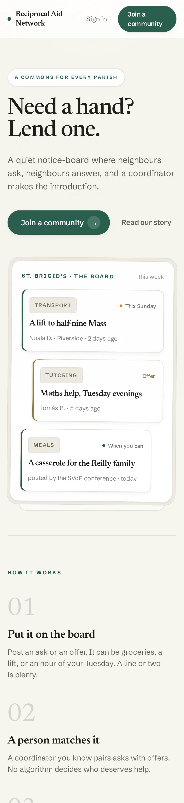

### 2. Two doors — join with a code, or start a board
The threshold print above the choice every parish makes once.

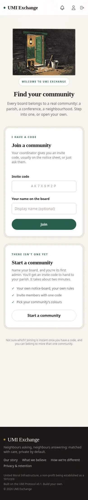

### 3. The hub — a living parish
Nuala's morning: a greeting by name with the parish's own line under it ("Bear one another's
burdens." — it turns over daily through lines the coordinators wrote), one ask in the spotlight,
the parish's pages a card away, the pulse of the week below.

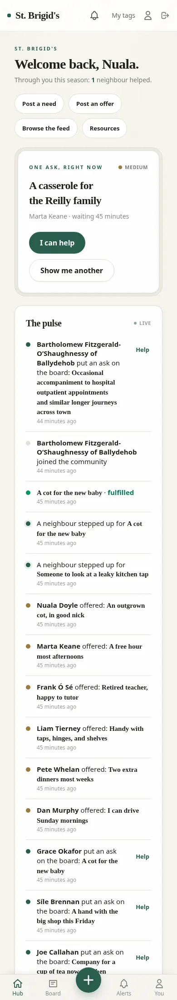

### 4. Posting an ask — a line or two is plenty
Categories as pictures, urgency in plain words — and the moment you post, the promise is
printed right on your ask: nothing about you is shared until you accept a match.

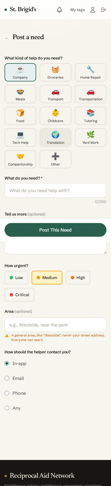

### 5. The board — asks and offers side by side
Bread-and-butter mutual aid: a ride to Mass, two extra dinners, a retired teacher.

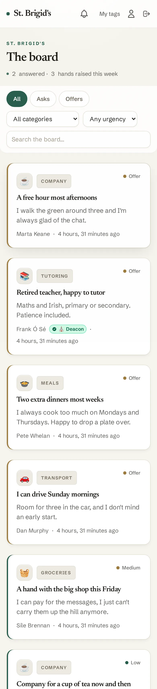

### 6. One ask, up close
Nuala's ride to the 9:30 Mass — and Dan's offer already waiting beside it.

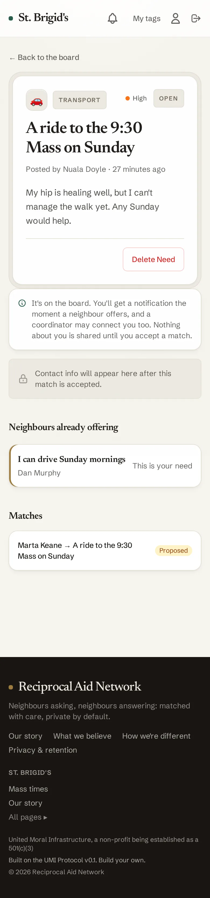

### 7. A match on the table
The coordinator proposed; both sides get a plain yes/no. Nothing is revealed yet.

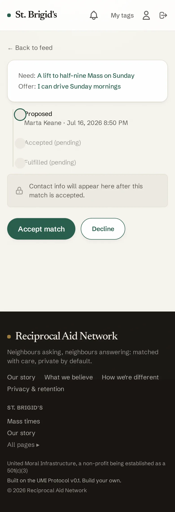

### 8. The connect — the reason all of this exists
Both said yes. The page settles, warms, and shares contact between the two of them and their coordinator — a trusted person keeping the introductions safe.

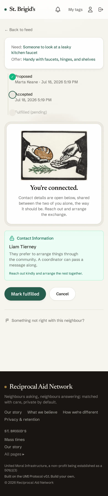

### 9. The front door — the parish before you sign in
St. Brigid's chose a scene, a line of welcome, and one page for the world. A visitor reads the
story and finds the join door; a private parish shows nothing at all — and looks exactly like
no parish.

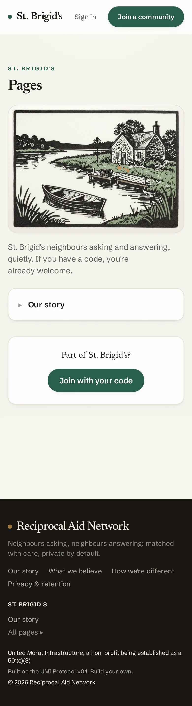

### 10. A page in the parish's own words
"We still don't." Every page is signed "Written by the coordinators of St. Brigid's" — always.
Drafted by a coordinator, published only by an admin: the priest signs, and signs again after
every fix.

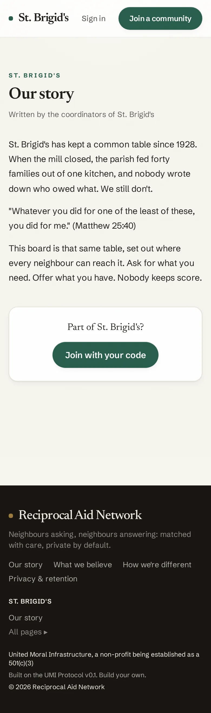

### 11. The floor everything stands on
The footer's "Built on the UMI Protocol" lands here, on this very instance — the whole promise,
readable on an offline laptop.

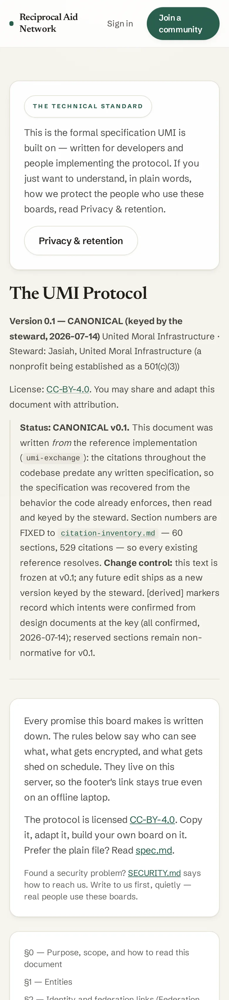

## If Father Mac pokes around

- A typo'd address gets the warm 404, not an error dump (that's why the demo runs `DEBUG=0`).
- A member opening a coordinators-only page gets a polite 403 in the same style.
- Empty screens invite the first action instead of apologising — notifications, resources,
  the tag queue, and a brand-new community all have warm empty states.

## Accessibility note

An automated **axe pass (WCAG 2.1 AA tags) now runs with the gallery shoot** —
`node docs/demo/shoot-demo.mjs` captures these screens and audits nineteen (the gallery plus the
manager, editor, settings-identity, tombstone, and moderation queue) in one go, writing
`docs/demo/axe-report.json`. As of the Stage-8 close-out, **every Layer C surface, the hub, the
settings page, the moderation queue, and /protocol/ pass with zero violations**; fixes included
the feed filters' missing accessible names, the bottom-nav label contrast, the footer's protocol
line, and the muted-text family on the new surfaces (small muted text now sits at 70% ink —
60% composites to 4.2:1 on stone, under AA's 4.5:1).

**The former known remainder is gone.** The six `color-contrast` violations that survived the
Stage-8 close-out (landing notice-card metas, /join/ sign-in links, board offer-card metas, a
need-detail meta block, two match-page lines) were cleared by the keyed muted-ink raise (#80);
the 2026-07-18 re-shoot (American-English demo strings) measures **zero violations across all
nineteen screens**. Gallery captured with `DEBUG=0`, the same conditions as the demo recipe
above.
